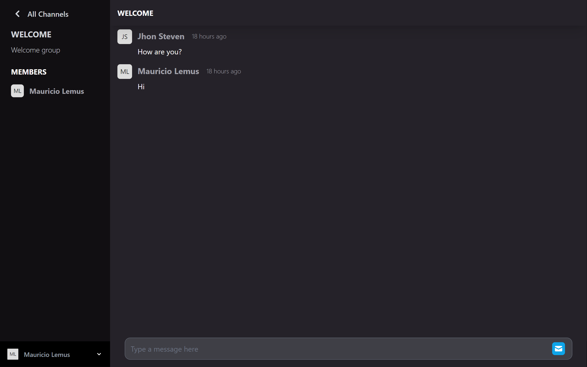

<h1 align="center">Chat Group</h1>

<div align="center">
   Solution for a challenge from  <a href="http://devchallenges.io" target="_blank">Devchallenges.io</a>.
</div>

<div align="center">
  <h3>
    <a href="chat-group-jmauricio22.vercel.app" target="_blank">
      Demo
    </a>
    <span> | </span>
    <a href="https://devchallenges.io/challenges/UgCqszKR7Q7oqb4kRfI0">
      Challenge
    </a>
  </h3>
</div>

<!-- TABLE OF CONTENTS -->

## Table of Contents

- [Overview](#overview)
  - [Built With](#built-with)
- [Features](#features)
- [How to use](#how-to-use)
- [Contact](#contact)
- [Acknowledgements](#acknowledgements)

<!-- OVERVIEW -->

## Overview



Chat application with a list of channels to connect and chat with other people.

### Built With

<!-- This section should list any major frameworks that you built your project using. Here are a few examples.-->

- [Next](https://nextjs.org/)
- [Nestjs](https://nestjs.com/)
- [Tailwind CSS](https://tailwindcss.com/)
- [Socket.IO](https://socket.io/)


## Features

<!-- List the features of your application or follow the template. Don't share the figma file here :) -->

This application/site was created as a submission to a [DevChallenges](http://devchallenges.io) challenge. The [challenge](https://devchallenges.io/challenges/UgCqszKR7Q7oqb4kRfI0) was to build an application to complete the given user stories.

- [x] User story: By default, I am in the Welcome channel

- [x] User story: I can create a new channel with a name and a description
- [x] User story: I can select a channel of my choice
- [x] User story: When I can select a channel, I am added as a member of the channel
- [x] User story: I can see a member of the channel
- [x] User story: I can send a message
- [x] User story: I can see other people's messages
- [x] User story(optional): I can search for a group

## How To Use

<!-- Example: -->

To clone and run this application, you'll need [Git](https://git-scm.com) and [Node.js](https://nodejs.org/en/download/) (which comes with [npm](http://npmjs.com)) installed on your computer. From your command line:

```bash
# BACKEND

# Clone this repository
$ git clone https://github.com/JMauricio22/weather-app.git

# Install dependencies
$ npm install

# Run the api
$ npm run start:dev
```

```bash
# FRONTEND

# Install dependencies
$ cd client && npm install

# Run the app
$ npm run dev

```

## Contact

- GitHub [@JMauricio22](https://github.com/JMauricio22)
